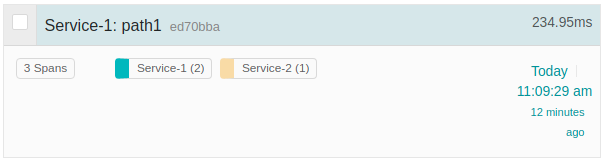
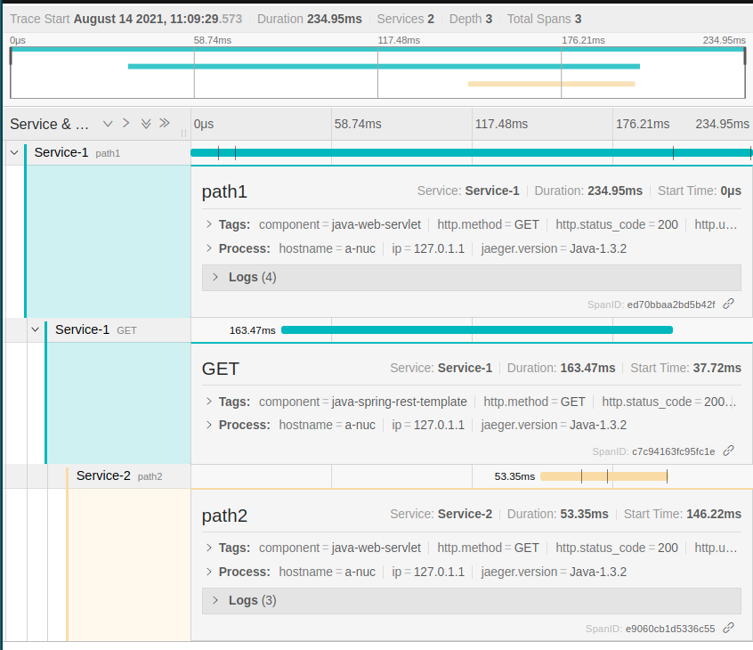

# Distributed tracing with Spring cloud Jaeger

In this project I have figured out how we can integrate distributed tracing using spring cloud jaeger which is based on Opentracing. 

You can read about this on my website [https://refactorfirst.com](https://refactorfirst.com)

Once you build the application using `mvn clean verify`, You can start the application as two service instances. 

Service 1
```
java -jar \
target/Distributed-Service-0.0.1-SNAPSHOT.jar \
--spring.application.name=Service-1 \
--server.port=8080
```

Service 2
```
java -jar \
target/Distributed-Service-0.0.1-SNAPSHOT.jar \
--spring.application.name=Service-2 \
--server.port=8090
```


I then visualize the traces using the Jaeger server.



Here are some trace details when a rest client sent out request from Service 1 and Service 2 receives it, processes the request, and returns the response.


